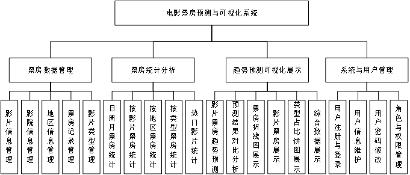

这个 找数据集就行   两个角色  管理员和用户  功能图上的  是必须要有的功能  不都是页面  页面按照我和你说的要求去做就行   这个要通过简单的计算来体现出未来票房的趋势

## 基于Python电影票房预测与可视化系统

二、主要内容：
本系统主要分为四个模块，二十个子功能，系统功能结构图如图1所示。

图1 系统功能结构图
（一）票房数据管理
1. 影片信息管理
负责影片基础信息的维护，包括影片名称、导演、主演、上映时间等内容，实现增删改查操作，保证影片数据的完整性与准确性。
2. 影院信息管理
用于管理不同影院的基本信息，包括地址、联系人、联系电话等，支持信息的新增、修改、删除和查询。
3. 地区信息管理
记录票房统计涉及的地区信息，支持地区的增删改查，为区域数据对比分析提供基础数据支撑。
4. 票房记录管理
负责维护每日票房数据记录，用户可对票房信息进行新增、编辑、删除和查询，用于后续统计分析。
5. 影片类型管理
用于维护影片所属类型（如剧情、动作、科幻等），便于按类型分析票房数据，实现分类增删改查。
（二）票房统计分析
1. 日/周/月票房统计
对票房记录按时间周期进行汇总统计，以数据报表方式展示票房变化的周期性趋势。
2. 按影片票房排名统计
按票房高低对影片进行排名，可了解不同影片的受欢迎程度和市场表现。
3. 按地区票房对比统计
对不同地区的票房数据进行对比分析，直观展示地域市场差异情况。
4. 按类型票房占比统计
对不同类型电影票房比例进行可视化统计，更好掌握各类型影片市场热度。
5. 热门影片Top10统计
展示票房表现最好的前十部影片，用于分析市场热点趋势。
（三）趋势预测与可视化展示
1. 影片票房趋势预测
基于历史票房变化数据进行趋势分析和预测，为票房走势研究提供辅助参考。
2. 预测结果对比分析
将预测结果与实际票房进行对比展示，验证预测的有效性和准确度。
3. 票房折线图展示
使用折线图形式展示票房随时间变化趋势，实现动态趋势观察。
4. 影片票房柱状图展示
采用柱状图展示不同影片或时间区间票房数据对比，提高数据可读性。
5. 类型占比饼图展示
利用饼图展示不同类型电影票房占比情况，直观体现市场份额结构。
6. 综合数据仪表盘展示
汇总关键指标（票房总额、Top榜单、增长趋势等）集中展示，为用户提供全面数据视图。
（四）系统与用户管理
1. 用户注册与登录
实现系统访问入口控制，用户通过注册与登录进入系统，并根据身份类型访问相应功能模块。
2. 用户信息维护
用户可查看与编辑个人资料信息，包括联系方式与个性化资料，保持信息更新和准确。
3. 用户密码修改
用户可自主修改账户密码，提高系统安全性和用户隐私保护。
4. 角色与权限管理
区分普通用户与管理员权限，通过权限控制实现系统操作范围限制，确保系统数据安全与规范管理。