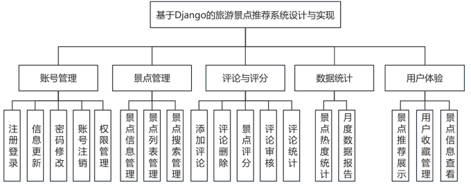

### 基于Django的旅游景点推荐系统设计与实现

一、主要内容：
本系统主要分为五个模块，十八个子功能，系统功能结构图如图1所示。

图1 系统功能结构图
（一）账号管理
1. 注册登录
该模块实现普通用户与管理员账号的登录功能，仅验证通过的用户可进入系统；不同权限的用户可使用的功能不同，保障系统的使用安全。
2. 信息更新
该模块记录用户的姓名、联系方式等详细信息，用户可自行修改这些信息，保证信息的及时准确；管理员可查看用户信息，辅助维护用户数据。
3. 密码修改
该模块支持用户自行修改账号密码，操作后需重新验证身份方可生效，避免账号信息泄露。
4. 账号注销
用户可通过该模块提交账号注销申请，管理员审核通过后，账号相关信息将从系统中移除。
5. 权限管理
该模块管理员可对用户账号执行开启或禁用操作，操作后对应账号将处于可使用或不可使用状态。
（二）景点管理
1. 景点信息管理
该模块记录景点的名称、地址、开放时间、简介等详细信息，管理员可对这些信息进行添加、修改、删除操作，保证景点信息的准确完整。
2. 景点列表管理
该模块将景点按类别、地区等整理为列表，用户可浏览该列表，快速了解系统内的景点资源。
3. 景点搜索管理
该模块支持用户通过景点名称、类别、地区等关键词搜索景点，搜索结果展示对应景点的信息，方便用户快速定位目标景点。
（三）评论与评分
1. 添加评论
用户浏览景点信息后，可通过该模块提交对景点的评论内容，评论填写完成后提交。
2. 评论删除
用户可删除自己提交的评论，删除后该评论不再展示；管理员可删除违规的评论内容。
3. 景点评分
用户可对景点进行评分，评分采用指定分数区间，提交后记录该用户的评分数据。
4. 评论审核
管理员通过该模块查看用户提交的评论，对含违规内容的评论进行驳回处理，审核通过的评论在系统中展示。
5. 评论统计
该模块对每个景点的评论数量进行统计，统计结果展示在景点信息页面。
（四）数据统计
1. 景点热度统计
该模块根据景点的浏览量、评论量、评分情况，统计各景点的热度数据，统计结果按热度高低排序。
2. 月度数据报告
该模块每月统计系统内的用户操作数据，包括新增用户数量、景点浏览总量、评论提交数量等，整理为数据报告，供管理员查看。
（五）用户体验
1. 景点推荐展示
该模块根据用户的浏览记录、收藏内容、评分偏好，展示对应的景点推荐内容，推荐内容呈现在用户首页。
2. 用户收藏管理
用户可将感兴趣的景点添加至收藏列表，也可从列表中移除景点，收藏列表由用户自行查看和管理。
3. 景点信息查看
用户可通过该模块查看景点的详细信息，包括基本介绍、开放时间、用户评论及评分等内容。